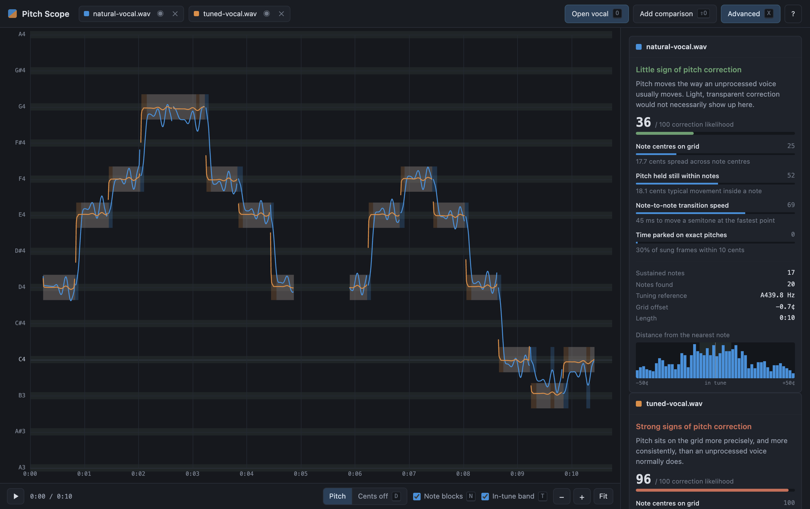
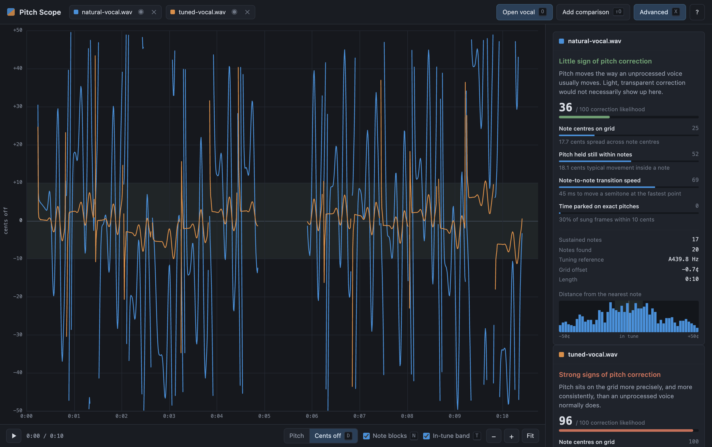

# Pitch Scope

A web tool for looking at the tuning of a vocal take. Load an isolated vocal and
every note the singer sings is drawn against the semitone grid. Silence is left
blank. Load a second vocal and both are drawn on the same graph in different
colours, so an original and a re-release can be compared directly.

Everything runs in your browser. No audio is uploaded anywhere.



Above: the same phrase sung naturally (blue) and hard-tuned (amber). The blue
line scoops into notes and wobbles with vibrato. The amber line snaps to the
gridlines and stays there. That contrast is the whole idea.

## Contents

- [Try it](#try-it)
- [Running it locally](#running-it-locally)
- [Using it](#using-it)
- [Keyboard shortcuts](#keyboard-shortcuts)
- [The correction score](#the-correction-score)
- [Advanced settings](#advanced-settings)
- [How it works](#how-it-works)
- [Tests](#tests)
- [Deploying](#deploying)

## Try it

Open the hosted version, then click **Load an example pair** on the start
screen. That loads two synthesised takes of the same phrase, one natural and one
hard-tuned, so you can see what each view looks like before you go hunting for
a stem of your own.

## Running it locally

It is a static site with no build step and no dependencies, so any web server
will do.

```sh
git clone https://github.com/j4ckxyz/pitch-scope.git
cd pitch-scope
npm start
```

Then open <http://localhost:8173>.

`npm start` is only a shortcut for `python3 -m http.server 8173`. Any equivalent
works, for example `npx serve` or `php -S localhost:8173`.

Opening `index.html` directly from your filesystem will **not** work. The
analysis runs in a module Web Worker, and browsers only allow those over
`http://` or `https://`.

## Using it

1. Click **Open vocal**, press <kbd>O</kbd>, or drag an audio file onto the
   window.
2. Wait a moment for the analysis. A four minute track takes about three
   seconds.
3. Read the graph. Each horizontal line is a semitone, labelled with its note
   name down the left edge.

Feed it an **isolated vocal**: a stem, an acapella, or a soloed track. Pitch
tracking follows one voice at a time, so given a full mix it will follow
whichever instrument is loudest, which is rarely the singer. If you only have a
finished mix, run it through a stem separator first.

Supported formats are whatever your browser can decode, which in practice means
WAV, MP3, FLAC, M4A, AAC and OGG.

### The two views

**Pitch** shows absolute pitch against a piano-roll grid. An untreated voice
weaves around the gridlines, scooping into notes, drifting, and adding vibrato.
Pitch correction pulls the line flat onto the grid.

**Cents off** (<kbd>D</kbd>) subtracts the nearest note, collapsing the whole
performance onto a single scale from −50 to +50 cents. A corrected take hugs the
zero line. An untreated one wanders across the full range. This is usually the
clearer of the two views.



### Comparing two takes

Press <kbd>X</kbd> for advanced mode, then click **Add comparison** (or press
<kbd>Shift</kbd>+<kbd>O</kbd>) and pick a second file. The two tracks are drawn
in blue and amber on the same axes, with a separate report for each.

You can also drag two files onto the window at once.

The tracks do not have to be the same song. Any two vocals can be compared, so
this works just as well for checking one singer against another, or one take
against another.

Press <kbd>1</kbd> or <kbd>2</kbd> to show and hide either track.

## Keyboard shortcuts

| Key | Action |
| --- | --- |
| <kbd>O</kbd> | Open a vocal track |
| <kbd>Shift</kbd>+<kbd>O</kbd> | Add a comparison track |
| <kbd>Space</kbd> | Play and pause |
| <kbd>←</kbd> <kbd>→</kbd> | Scroll through time, with <kbd>Shift</kbd> for a bigger step |
| <kbd>↑</kbd> <kbd>↓</kbd> | Move the pitch range up and down |
| <kbd>+</kbd> <kbd>−</kbd> | Zoom in and out |
| <kbd>0</kbd> | Fit the whole track |
| <kbd>D</kbd> | Switch between the pitch and cents-off views |
| <kbd>N</kbd> | Show or hide note blocks |
| <kbd>T</kbd> | Show or hide the in-tune band |
| <kbd>1</kbd> <kbd>2</kbd> | Show or hide track 1 or track 2 |
| <kbd>X</kbd> | Advanced controls |
| <kbd>?</kbd> | List the shortcuts |

With the mouse: drag to pan, scroll to zoom, click to move the playhead, and
hover to read the note and its offset in cents.

## The correction score

The sidebar reports a likelihood from 0 to 100, built from four independent
indicators. Each is shown separately with the measurement behind it, so you can
see which ones are driving the number.

| Indicator | What it measures | Corrected takes tend to |
| --- | --- | --- |
| Note centres on grid | scatter of note centres, in cents | sit within a few cents of the grid |
| Pitch held still within notes | movement inside a sustained note | stay flat, with drift and vibrato reduced |
| Note-to-note transition speed | the fastest slope at a note change | snap across in tens of milliseconds |
| Time parked on exact pitches | share of frames inside the tolerance | park on the grid most of the time |

### Tuning reference

Before any of this is measured, the track's own tuning reference is estimated
and subtracted. A session cut at A=442 is not out of tune, and without this
correction every statistic downstream would be wrong.

The estimate uses a circular mean, because deviations wrap around at ±50 cents.
A take centred near that wrap would otherwise average out to zero. Whatever
reference it settles on is shown in the advanced panel as **Tuning reference**,
alongside the **Grid offset** in cents.

### This is not proof

Tight tuning can mean pitch correction. It can also mean an exceptional singer,
a heavily comped take, or simply a short passage that happens to be accurate.
Light, transparent correction may not show up at all.

Treat a high score as a reason to listen closely and to compare against another
take, not as a verdict. The most useful thing this tool does is put two versions
side by side.

As a sanity check, the test suite includes a synthesised "very accurate singer"
which scores 0.64 and is deliberately reported as *"Some signs of pitch
correction, but a very accurate singer can look like this"*, against 0.36 for a
loose natural take and 0.96 for a hard-tuned one. Avoiding that false positive
mattered more than producing a confident number.

## Advanced settings

Press <kbd>X</kbd> and open **Analysis settings**.

- **In-tune tolerance**: the ± window counted as being on the grid. This changes
  the shaded band and the histogram only, not the analysis.
- **Shortest note counted**: runs briefer than this are treated as passing tones
  rather than notes. Raise it for melismatic singing.
- **Silence threshold**: how far below the loud passages counts as silence.
  Raise it if quiet phrases are being dropped from the graph.
- **Voice range**: narrowing this to the singer's actual range is the best way
  to prevent octave errors.

Changing any of the last three re-runs the analysis on every loaded track.

## How it works

| File | Role |
| --- | --- |
| [`js/dsp.js`](js/dsp.js) | YIN pitch detection, silence gating, contour cleanup |
| [`js/music.js`](js/music.js) | Note conversions, tuning estimation, segmentation, indicators |
| [`js/worker.js`](js/worker.js) | Runs the analysis off the main thread and reports progress |
| [`js/plot.js`](js/plot.js) | Canvas rendering of the piano roll and both views |
| [`js/app.js`](js/app.js) | File loading, playback, interaction, report panel |

Audio is downmixed to mono and resampled to 22.05 kHz, then tracked at a 10 ms
hop using [YIN](https://doi.org/10.1121/1.1458024). The difference function is
searched coarsely at half rate and refined at full rate with parabolic
interpolation, which keeps a four minute stem under three seconds while staying
accurate to a cent or two.

Frames are gated on level and on aperiodicity. The level gate measures against a
95th-percentile reference rather than the peak, so a single loud breath cannot
raise the floor across the whole track. `cleanContour` then removes octave
errors and brief excursions, which is what stops a single stray frame drawing a
full-height spike across the plot.

## Tests

```sh
npm test                    # DSP and music theory, in Node
npm start                   # in another terminal, then:
npm run test:browser        # drives real Chrome over CDP
```

The Node suite covers pitch accuracy against synthesised tones, silence gating,
octave and spike removal, tuning estimation, and the separation between natural,
corrected and merely accurate takes.

The browser suite drives the real interface: loading, comparison, every keyboard
shortcut, playback, drag, zoom, the report panel, error handling, degenerate
input, and the narrow layout. It asserts on computed styles and hit testing
rather than element properties, because an element that is hidden but still laid
out will silently swallow every click. That bug was real and this suite is what
caught it.

Other scripts:

```sh
npm run fixtures            # regenerate the example and test WAVs
node test/screenshots.js    # regenerate the images in this README
```

## Deploying

Any static host works, since there is no build step. Upload the repository root
and you are done.

This copy is hosted on [Cloudflare Pages](https://pages.cloudflare.com/). To do
the same with your own fork, connect the repository in the Cloudflare dashboard
and use these settings:

| Setting | Value |
| --- | --- |
| Framework preset | None |
| Build command | *(leave empty)* |
| Build output directory | `/` |

There is nothing to compile, so Pages simply serves the files as they are. The
[Git integration
guide](https://developers.cloudflare.com/pages/get-started/git-integration/)
covers the dashboard steps in full.

To deploy from the command line instead:

```sh
npx wrangler pages deploy . --project-name=pitch-scope
```

## Licence

MIT. See [LICENSE](LICENSE).
